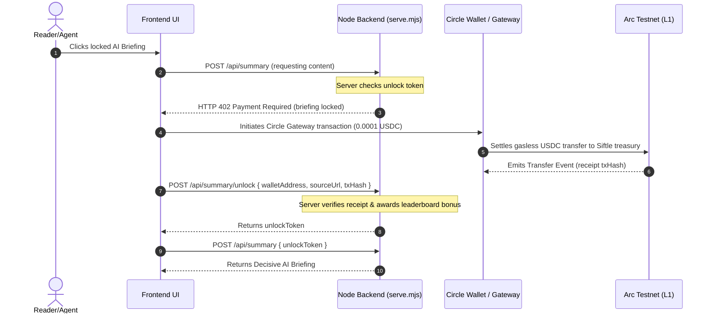

# Siftle: Paid AI Briefings & Nanopayments on Arc

Hey there! Welcome to Siftle. Let me walk you through what we've built, how it works under the hood, and how we use Circle and Arc to power sub-cent nanopayments.

Siftle is a football news and prediction platform designed to monetize micro-information. Rather than forcing sports readers into a full monthly subscription, Siftle unbundles context. We sell individual, high-value **AI Briefings** for **0.0001 USDC** at the exact moment user interest is highest—right when they are deciding on a prediction market.

---

## 💡 Why we fit RFB 02 and RFB 06

We sat down and realized Siftle sits right at the intersection of two major Requests for Builders:

* **RFB 02: Selling Agent Services via Nanopayments**:
  Siftle's AI Briefing is not a static news article. It is an **AI Analyst Agent Service** running on the backend. When a user requests context, the AI agent pulls the live news thread, clusters source updates, and constructs a structured analysis (**What Happened**, **Key Points**, **Takeaway**). We monetize this agent's work at the micro-level: **0.0001 USDC per request**, paid dynamically.
* **RFB 06: Creator & Publisher Monetization**:
  Subscriptions are too heavy for daily, casual reading. Siftle proves that micro-payments remove the paywall floor. By pricing briefings at $0.0001, we show a viable path for newsletters, journalists, and independent creators to monetize single updates.

---

## 🛠️ How it Works: The x402 Web Service Flow

Here is exactly how our x402 protocol flow works in the codebase:



### Under the Hood:
1. **The 402 Paywall**: When a client requests an AI summary via `/api/summary` without a valid token, the backend throws a custom error:
   ```javascript
   const error = new Error("AI briefing unlock payment required");
   error.statusCode = 402;
   throw error;
   ```
2. **The x402 Payment**: The client catches this `402` error, prompts the user's connected Circle wallet, and executes a gas-free payment of **0.0001 USDC** to Siftle's treasury address on the Arc testnet.
3. **Receipt Verification**: The frontend submits the transaction hash to `/api/summary/unlock`. The server runs `verifyAiBriefingUnlockPayment(body)` by inspecting the transaction on ArcScan, logs the unlock, and returns a secure `unlockToken`.
4. **Context Delivered**: The client submits the unlock token to fetch the decrypted structured briefing.

---

## 💻 Our Tech Stack & Implementation Details

Here is the exact stack we put together to make this fast, cheap, and robust:

### 1. Circle developer stack
* **Circle Email Wallet Onboarding**: We use Circle's OTP authentication to let first-time users sign up with just an email. Behind the scenes, Circle generates a secure, compliant embedded wallet for them instantly.
* **Circle CLI & SDK**: Wire the wallet onboarding and transaction approvals into the client, showing USDC balances and handling contract calls.

### 2. Arc L1 Settlement
* **Sub-second Finality**: When users submit a transaction to buy Yes/No shares or unlock a briefing, Arc settles it in **under 500ms**, keeping the UI responsive.
* **USDC-native Gas**: Siftle users don't need to hold a volatile native token just to pay gas. Everything is denominated and settled in USDC.

### 3. AI & Data Layers
* **0G Compute**: Used for on-demand summary generation when external LLM pipelines are congested.
* **Shelby Network**: We back up and archive our 48-hour rolling news snapshots directly to the Shelby testnet to maintain a transparent, tamper-proof history of the sources.
* **Supabase**: Handles the persistent gamification state—leaderboard scores, divisional rankings, wins, losses, and user profiles.

### 4. Client Presentation & Card Exporter
We wanted Siftle to be highly shareable on Twitter/X, so we built a **Briefing Card Exporter** on the client:
* **The Spacing Bug we fixed**: In `html2canvas`, media queries (like `@media (max-width: 640px)`) are evaluated against the browser's window width, which caused cards downloaded on mobile phones to look compressed and squished.
* **Our Solution**: In `src/main.ts#downloadBriefingCard`, we clone the card and explicitly **hardcode and apply the desktop layout inline** using JavaScript (outer card width of `704px`, padding `28px 30px`, section box padding `18px 20px 18px 22px`, section margin `14px`, and `1rem` typography).
* **The html2canvas Inline Style Bug we fixed**: `html2canvas`'s internal CSS parser completely ignores inline styles that use the `!important` flag. We rewrote our JS style setters to use standard DOM properties (e.g., `sec.style.backgroundColor = '#f1f5f9'`) without `!important`, ensuring the beautiful gray background cards render consistently on every single download, even if it's the 100th time.

---

## ⚙️ Environment Variables

Create a `.env` file at the root of the project to set up local environments:

```ini
PORT=5173
PUBLIC_API_BASE_URL=http://localhost:5173
SIFTLE_API_BASE=http://localhost:5173

# Database (Supabase)
SUPABASE_URL=your_supabase_url
SUPABASE_ANON_PUBLIC_KEY=your_supabase_anon_key
SUPABASE_SERVICE_ROLE_KEY=your_supabase_service_role_key

# Circle Developer Stack
CIRCLE_API_KEY=your_circle_api_key
CIRCLE_APP_ID=your_circle_app_id
RESEND_API_KEY=your_resend_api_key
RESEND_FROM=notifications@yourdomain.com

# Arc L1 Chain Config
ARC_TESTNET_RPC_URL=https://rpc.testnet.arc.network
ARC_TESTNET_USDC_ADDRESS=0x3600000000000000000000000000000000000000
ARC_DEPLOYER_PRIVATE_KEY=your_private_key
REOWN_PROJECT_ID=your_reown_project_id

# Treasury & Nanopayment Config
AI_BRIEFING_TREASURY_ADDRESS=your_treasury_address
AI_BRIEFING_UNLOCK_USDC=0.0001
X402_PRICE=0.0001

# 0G Compute Configuration
OG_RPC_URL=https://evmrpc.0g.ai
OG_COMPUTE_PROVIDER=your_provider
OG_COMPUTE_ENDPOINT=your_endpoint
OG_COMPUTE_API_KEY=your_api_key
OG_USAGE_MODE=conserve

# Feed Scrapers & Archiving
NEWSDATA_API_KEY=your_newsdata_key
GUARDIAN_API_KEY=your_guardian_key
SHELBY_UPLOAD_URL=your_shelby_upload_url
SHELBY_API_KEY=your_shelby_api_key
```

---

## 🛠️ Local Development

### 1. Install Dependencies
```bash
npm install
```

### 2. Build Frontend Bundle
```bash
npm run build
```

### 3. Run Verification Tests
```bash
npm test
```

### 4. Start Local Server
```bash
node scripts/serve.mjs
```
The app will run locally at [http://localhost:5173](http://localhost:5173).

---

## 📡 API Reference

```txt
GET  /api/status               - Fetch health and connectivity status
GET  /api/markets              - Retrieve active Yes/No markets on Arc
GET  /api/feed                 - Ingest clustered news feed
GET  /api/market-thread        - Retrieve related news source updates
GET  /api/leaderboard/global   - Global ranking data
GET  /api/analytics/report     - Fetch briefing unlocks and volume stats
POST /api/summary/unlock       - Verify x402 payment transactions
POST /api/summary              - Fetch briefing content (throws 402 if locked)
POST /api/circle/auth/otp      - Trigger Circle OTP email authentication
POST /api/circle/auth/verify   - Verify OTP and generate wallet instance
```
