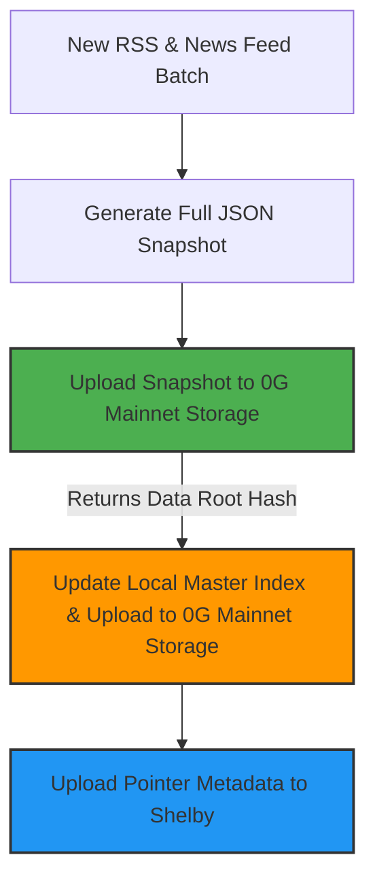
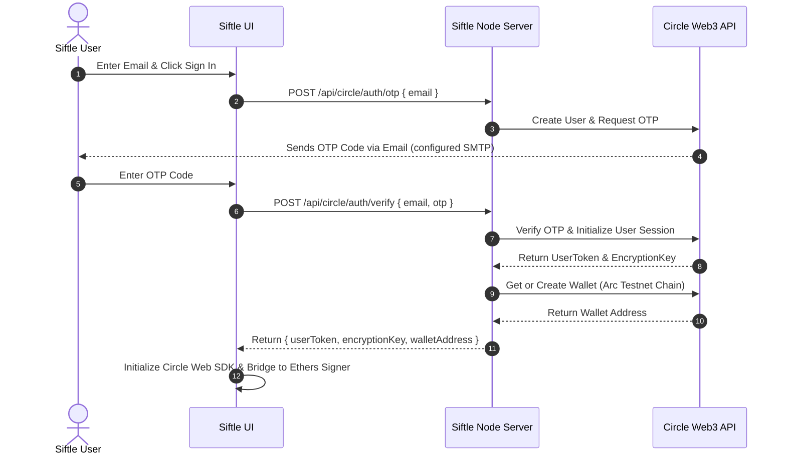

# Implementation Plan - 0G Storage + Shelby Archiving & Circle Wallet Integration

This plan details the architecture and code changes required to run Siftle's archiving and thread matching using **0G Mainnet Storage** and **Shelby**, and to completely replace Reown AppKit/WalletConnect with **Circle Programmable Wallets (User-Controlled)** for secure email OTP sign-in.

---

## 1. Storage & Archiving Architecture

To prevent data loss or user-facing errors when devnets are wiped or leases expire, Siftle will use a dual-storage strategy:



1. **Data Layer (0G Mainnet Storage - Cheap & Persistent)**:
   - Stores the full daily snapshots (all news stories, source links, summaries, and AI details).
   - Stores a **Master History Index** (`siftle_master_index.json`) that lists every daily snapshot date, category, and its corresponding 0G Storage data root hash. This master index is updated and uploaded to 0G Mainnet Storage.
2. **Index Layer (Shelby - Coordination & Proofs)**:
   - Stores a lightweight pointer pointing to the 0G Storage root hash:
     `{ "date": "YYYY-MM-DD", "category": "Crypto", "0g_data_root": "0xabc123..." }`
3. **Resilience & Retrieval Flow**:
   - **Primary Read**: The app queries Shelby to get the `0g_data_root` for a given date/category, then downloads the full JSON from 0G Mainnet Storage.
   - **Fallback Read (Shelby Wiped / Expired)**: If Shelby returns no pointers (or is down/wiped), the app queries the **Master History Index** directly from 0G Mainnet Storage, resolves the `0g_data_root` for that date, and downloads the snapshot. 

---

## 2. Wallet & Identity Architecture (Circle Web3 Services)

We will replace Reown AppKit / WalletConnect entirely with **Circle User-Controlled Programmable Wallets**. This allows users to register or sign in using their email address with a One-Time Password (OTP) verification flow, bypassing external browser extension wallets (MetaMask/Rabby).

### Authentication & Wallet Creation Flow


### Transaction Signing
- The **Circle Web SDK** (`@circle-fin/w3s-pw-web-sdk`) renders a secure UI iframe/modal whenever a PIN entry or security answers are needed (e.g. initial wallet creation, or signing transactions like approval and purchase of YES/NO tokens).
- We will write an Ethers Signer wrapper (`CircleSigner`) in [src/arc.ts](file:///C:/Users/user/Desktop/Siftle/src/arc.ts) that intercepts transactions and calls the Circle Web SDK client to execute them on the Arc Testnet.

---

## User Review Required

> [!IMPORTANT]
> **SMTP Server for Circle OTPs**
> When using Circle's Email OTP verification, Circle coordinates the session, but **does not send the emails on your behalf**. We need to configure an SMTP server or email delivery API (e.g., SendGrid, Resend, or Mailgun) in Siftle's backend to deliver the verification emails to users.
> We will need credentials for this mail service in Siftle's `.env`.

> [!IMPORTANT]
> **EVM Private Key & Gas Fees for 0G Mainnet Storage**
> Uploading data to 0G Mainnet Storage requires submitting transactions on the 0G chain, which incurs gas fees. The user has confirmed the EVM key will be pre-funded. We will use `OG_STORAGE_PRIVATE_KEY` in `.env`.

---

## Proposed Changes

### Dependencies

#### [MODIFY] [package.json](file:///C:/Users/user/Desktop/Siftle/package.json)
- Add `@0gfoundation/0g-storage-ts-sdk` for Merkle proof generation and uploads to 0G Mainnet Storage.
- Add `@circle-fin/w3s-pw-web-sdk` to manage user-controlled wallets and show secure PIN modals in the browser.
- Add an email helper (e.g., `nodemailer`) to send OTP emails from the backend.

---

### Environment Configuration

#### [MODIFY] [.env.example](file:///C:/Users/user/Desktop/Siftle/.env.example) and [.env](file:///C:/Users/user/Desktop/Siftle/.env)
- Add variables for 0G Mainnet Storage:
  ```txt
  OG_STORAGE_RPC_URL=https://evmrpc.0g.ai
  OG_STORAGE_INDEXER_URL=https://indexer-storage-turbo.0g.ai
  OG_STORAGE_PRIVATE_KEY=
  ```
- Add variables for Circle Web3 Services and Email OTP delivery:
  ```txt
  CIRCLE_API_KEY=
  CIRCLE_APP_ID=
  SMTP_HOST=
  SMTP_PORT=
  SMTP_USER=
  SMTP_PASS=
  SMTP_FROM=
  ```

---

### Storage Modules

#### [NEW] [zeroGStorage.mjs](file:///C:/Users/user/Desktop/Siftle/scripts/zeroGStorage.mjs)
Create a helper module to handle uploads and downloads directly from 0G Mainnet Storage:
- `isZeroGStorageConfigured()`: Check for required environment variables.
- `uploadToZeroGStorage(jsonData)`: Converts JSON to a buffer, uploads it to 0G Storage, and returns the Merkle Root Hash (`dataRoot`).
- `downloadFromZeroGStorage(dataRoot)`: Downloads the file by Merkle root directly from the 0G Indexer REST endpoint (`GET /file?root=...`) and parses it back to JSON.
- `updateMasterIndex(date, category, dataRoot)`: Appends the metadata pointer to a local `siftle_master_index.json` and uploads the updated file to 0G Storage, keeping track of the latest master index data root hash.

#### [MODIFY] [shelbyArchive.mjs](file:///C:/Users/user/Desktop/Siftle/scripts/shelbyArchive.mjs)
- Modify `uploadShelbySnapshot` to only upload a lightweight index metadata object containing the 0G Storage `dataRoot` instead of the full story JSON payload.
- Update `downloadShelbySnapshot` to retrieve this lightweight index, read the `dataRoot` pointer, and then fetch the actual full JSON from 0G Storage.

---

### Wallet & Blockchain Bridge

#### [MODIFY] [src/arc.ts](file:///C:/Users/user/Desktop/Siftle/src/arc.ts)
- **Remove Reown AppKit**: Strip all imports, configs, and setup for `@reown/appkit` and `@reown/appkit-adapter-ethers`.
- **Implement Circle Web SDK**:
  - Initialize the `W3SSdk` using `window.CIRCLE_APP_ID`.
  - Implement authentication calls: sending requests to our backend auth endpoints.
  - Expose a `CircleSigner` that uses the user's active session (`userToken`, `encryptionKey`) to sign approvals and purchase transactions on the Arc Testnet.

---

### Core Application / Server Logic

#### [MODIFY] [serve.mjs](file:///C:/Users/user/Desktop/Siftle/scripts/serve.mjs)
- **Archive Flow**:
  - Update `archiveSnapshot`:
    1. Upload the full snapshot JSON to **0G Mainnet Storage** -> get `dataRoot`.
    2. Update and upload the **Master History Index** to 0G Mainnet Storage.
    3. Write a lightweight index metadata object containing `dataRoot` to **Shelby**.
    4. Remove the local filesystem `writeJsonFile` calls for long-term archiving.
- **Retrieval & Feed Flow**:
  - Update `readArchiveSnapshot` and `getHistoricalThreadCandidates`:
    1. Retrieve the lightweight metadata list from Shelby.
    2. If Shelby fails (devnet wiped/wiped index), query the **Master History Index** directly from 0G Mainnet Storage.
    3. Download the full story feeds from **0G Mainnet Storage** using the retrieved data roots.
    4. Run thread matching candidates in-memory.
    5. Cache the downloaded snapshots in an in-memory Map (with automatic TTL) to prevent repeated network fetches on every HTTP request.
- **Circle Auth Endpoints**:
  - `POST /api/circle/auth/otp`: Calls Circle's API to initiate signup/login and uses `nodemailer` to email the OTP verification code to the user.
  - `POST /api/circle/auth/verify`: Verifies the OTP code with Circle, retrieves or initializes the user's wallet address, and returns the authentication tokens to the client.

---

### Frontend UI

#### [MODIFY] [src/main.ts](file:///C:/Users/user/Desktop/Siftle/src/main.ts)
- Build a new Modal/Overlay for email authentication:
  - Phase 1: Input email address (click "Send Code").
  - Phase 2: Input OTP code (click "Verify").
- Hook up the wallet button (`#walletButton`) click handler to trigger this new modal.
- Update UI details to display user email/address and portfolio balances read via the `CircleSigner`.

---

## Verification Plan

### Automated Tests
- Run `npm test` to verify feed health rules and prediction market rules.

### Manual Verification
1. Start the server: `node scripts/serve.mjs`.
2. Open Siftle in the browser (`http://localhost:5173`).
3. Click "Connect Wallet", input an email address, verify that the OTP email is sent and received.
4. Input the OTP and verify that the wallet is successfully generated on the Arc Testnet.
5. Fund the new user's wallet with testnet USDC, and verify that they can approve and execute buys/sells of market shares using the Circle secure PIN interface.
